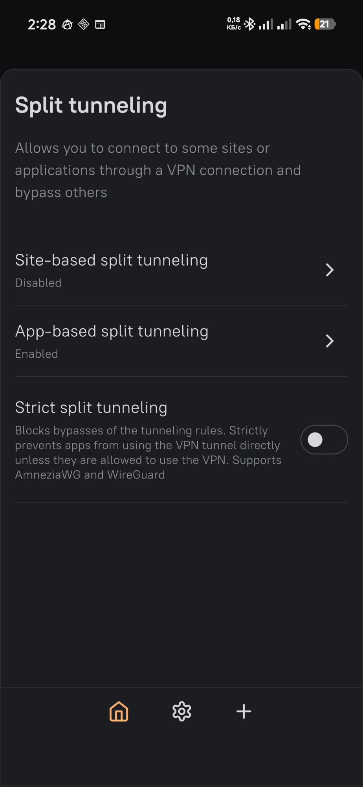
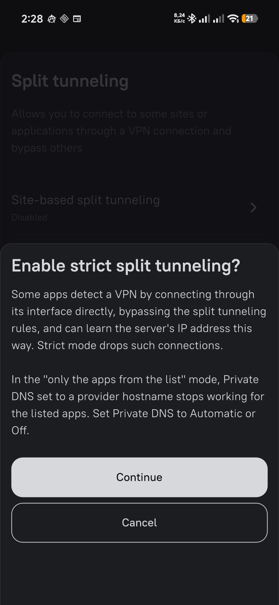
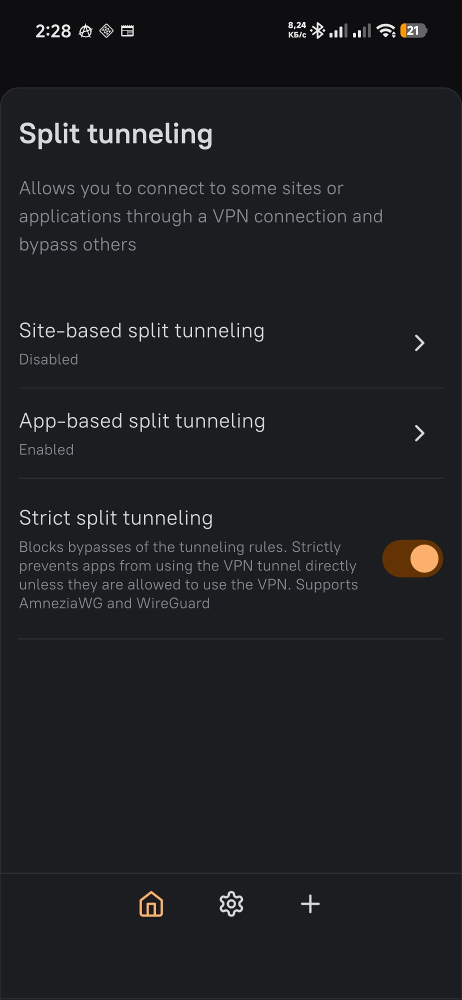
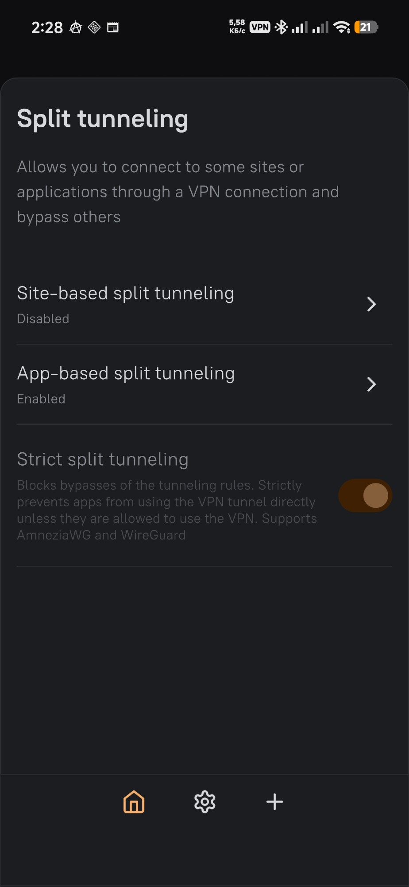

# Strict split tunneling for AmneziaVPN — notes and probes

Working notes behind a fix for [amnezia-vpn/amnezia-client#2457](https://github.com/amnezia-vpn/amnezia-client/issues/2457): on Android, an app excluded from per-app split tunneling can bind a socket to `tun0` and reach the VPN server, which reveals the server's address.

This repository holds the reasoning, the traps found on the way and the probes used to measure the fix. The code lives in three pull requests:

| Repo | PR | What it carries |
|---|---|---|
| amneziawg-go | [#199](https://github.com/amnezia-vpn/amneziawg-go/pull/199) | the `uidfilter` package and the hook in the tun read loop |
| amneziawg-android | [#104](https://github.com/amnezia-vpn/amneziawg-android/pull/104) | the JNI bridge that asks the Java side who owns a connection |
| amnezia-client | [#3199](https://github.com/amnezia-vpn/amnezia-client/pull/3199) | the "Strict split tunneling" setting and the wiring |

A test build of the three together, signed with my own key: [v5.0.3.1-strict.7](https://github.com/amnezia-tun0-fix/amnezia-client/releases/tag/v5.0.3.1-strict.7). It installs next to the official app, as «AmneziaVPN Strict». Two more fixes, kept out of the pull requests so they stay small, are in the build and on their own branches: [`followup/inbound-synack`](https://github.com/amnezia-tun0-fix/amneziawg-go/commits/followup/inbound-synack) and [`followup/fragments`](https://github.com/amnezia-tun0-fix/amneziawg-go/commits/followup/fragments).

Not affiliated with Amnezia. These are one contributor's notes, published because a reviewer of those PRs may want the reasoning behind them.

## Start here

- [docs/start.md](docs/start.md) — what to read for which question
- [docs/architecture.md](docs/architecture.md) — the decisions, A01–A12: why the filter is in userspace, why Go asks and Kotlin decides, why an unresolved owner is denied, why the test build installs next to the official app
- [docs/gotchas.md](docs/gotchas.md) — twenty-five traps that cost time, including the six worth knowing before writing this kind of filter:
  - **G11** any app can ping through `tun0`, and ICMP has no owner to look up
  - **G08** `getConnectionOwnerUid` answers `INVALID_UID` for any app your VPN does not cover, not only when no socket matches
  - **G09** a socket the app has closed belongs to UID 0, so re-judging a flow drops its FIN
  - **G03** `/proc/net/tcp` shows a process only its own sockets since Android 10
  - **G13** a cloned app has a uid of its own, and one entry in the VPN's app list covers it
  - **G24** a Go thread that called into Java and is locked to its goroutine exits with every signal blocked, and detaching it from the JVM there can kill the process without a tombstone
- [docs/status.md](docs/status.md) — what works, what is fragile, what is deferred
- [docs/references/device-testing.md](docs/references/device-testing.md) — how the checks on a phone are run: the builds, driving them from adb, the probes, the method
- [docs/journal.md](docs/journal.md) — how it went, newest first

## Probes

Standard library Python, meant to run in Termux as an app that is **outside** the VPN. They print a summary and write it to `/sdcard/Download/`.

```sh
python leak_probe.py <label> [vpn_server_ip]   # TCP, UDP and curl bound to tun0
python icmp_probe.py <label> [target ...]      # ICMP echo from an unprivileged ping socket
python dns_probe.py  <label> [vpn_server_ip]   # DNS through the system resolver, as a listed app
```

`leak_probe.py` reports `LEAK(SERVER_IP)` when a bypass attempt reaches the far side from the VPN server's address. On the build with the fix, strict mode on gives 0 of 6 and ICMP times out; with it off, 6 of 6 and ping answers.

More probes, same style: `udp_flow_probe.py` (loss on one long UDP flow, and large datagrams that get fragmented), `inbound_probe.py` (connections and ping *into* the phone through the tunnel, from another peer of the same server), `udp_traceroute.py` (plain traceroute without root). `awgctl.sh` drives the test build from adb without taps, and `uf_counters.py` sums the counters an experimental build logs. [docs/references/device-testing.md](docs/references/device-testing.md) says which answers what.

`tools/churn_probe` is a Go program for load: TCP connect latency through the tunnel while another process opens new UDP flows at a fixed rate, with the sockets held open or closed at once, and a mode that counts answered DNS queries from fresh sockets. Build it with `GOOS=android GOARCH=arm64 CGO_ENABLED=0 go build`, push it to `/data/local/tmp` and run it from `adb shell`; the usage is at the top of `main.go`. The numbers it produced are in [amneziawg-go#199](https://github.com/amnezia-vpn/amneziawg-go/pull/199) and in [G15](docs/gotchas.md).

`tools/preflight.py` is not a probe but a guard for our own pushes: run from the umbrella directory next to the fork clones, it checks that a `pr/*` branch carries no fork `replace`, that the AmneziaWG hook sits after `elem.padding` ([G04, G06](docs/gotchas.md)), and that the fork-only package name and adb control of the test build stay out of it ([A11, A12](docs/architecture.md)). `--install` adds it to the forks as a pre-push hook.

## The setting

|  |  |  |  |
|---|---|---|---|
| Off by default, under app split tunneling | Turning it on explains the trade-off | On | Locked while connected |

## License

The documents and the probes are published under the MIT license (see [LICENSE](LICENSE)). The code in the pull requests follows the license of each upstream repository.
